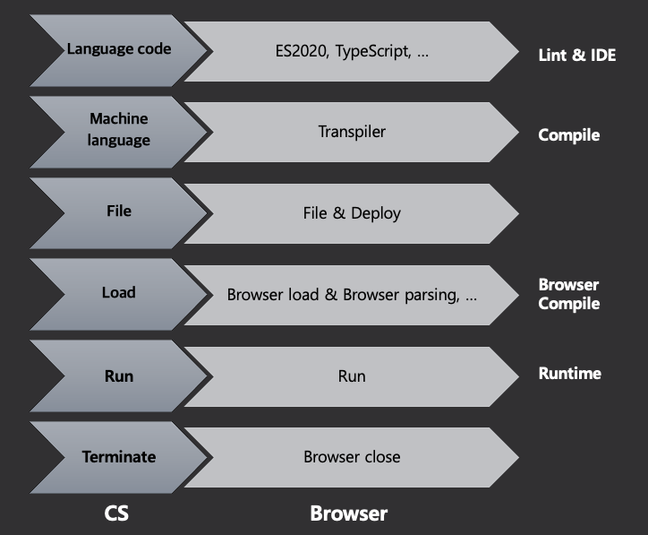
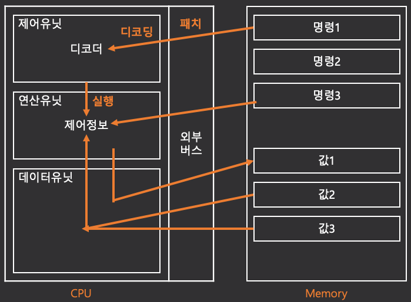

# 1-2. Runtime

> 본 문서는 [코드스피츠 85](https://www.youtube.com/watch?v=0NsJsBdYVHI&list=PLBNdLLaRx_rImvbuZnfO-Ecv9OpuCNoCl) 의 내용을 바탕으로 작성되었습니다.

**목차**

1. [Program & Timing](#program-timing)
2. [Runtime](#runtime)
3. [State Control](#state-control)
4. [Flow Control](#flow-control)
5. [Sync & Async](#sync-async)

## TL;DR

- 런타임에 대하여 알아봅니다.
- CPS 에 기반한 프로그래밍의 필요성에 대하여 알아봅니다.

# Program & Timing



웹 상의 자바스크립트에선 일반적인 컴파일언어와 달리 Browser compile 과정이 존재합니다.

이 과정은 브라우저가 살아있는 한 지속적으로 수행되게 되며, 이 과정에 개입하기위해 우리는 패키징 매니저(webpack 등)를 사용하게 됩니다.

# Runtime



1. **Loading**
   - 파일 실행 시 명령과 값으로 분리되어 메모리에 적재
2. **Instruction**
   - 작성한 코드를 머신의 CPU 가 해석할 수 있는 명령체계로 변경
   - 메모리의 명령을 Fetch 하여 Instruction 으로 Decoding 한 뒤, 해당 값을 레지스터에서 연산
3. **Execution**
   - Instruction 가 완료되는 즉시 수행하며, 필요에 따라 메모리에 결과값을 반환

Loading 이후 Instruction fetching ~ Execution 이 반복되며 이를 `Runtime` 이라 합니다.

메모리에 적재한 명령은 일반적인 폰 노이만 머신에서 Sync flow 로 처리되며, 모든 명령을 소비하면 `Terminate` 가 발생합니다.

우리는 OS 의 명령 처리에 직접적으로 개입할 수 없습니다.

## Details

개발적인 측면에서 런타임을 살펴보겠습니다.

1. **essential definition loading**
   - 코드 실행에 앞서 필수 정의사항을 로드
2. **vtable mapping**
   - 컴파일러는 메모리 공간을 확보하기 위한 가상 메모리 공간을 사용
   - 컴파일러가 변수를 가상으로 매핑하여 컴파일 후, 해당 변수와 실제 메모리를 매핑
3. **run**
4. **runtime definition loading**
5. run
6. runtime definition loading...

자바스크립트 런타임은 그 특징에 따라 브라우저 로드에서부터 런타임이라 칭하지만, 정의 시점과 실행 시점을 나누는 기준은 존재합니다.

1. browser load
2. browser parsing
3. run

# State Control

메모리 내에서 값은 계속 변하기 때문에 상태라고 부릅니다.

이러한 상태는 어떻게 관리해야 할까요?

## Directive Refernce

```javascript
a = 'TEST'
a주소 = 00, a크기 = 4
b = &a // b에 a의 주소값을 할당
c = &b // c에 b의 주소값(a의 주소값)을 할당.
a = b & b =c (a=c) // 결국 a와 c도 같은 상황
d = 'ABC'
b = &d // b에 d의 주소를 재할당
b = d & b != c (a=c)
```

여기서, `b` 와 `c` 의 싱크가 깨진 것을 즉각적으로 인지할 수 있을까요?

**직접 참조의 문제점**

- 추적이 힘듦
- 참조 변수를 외부에 공유하면, 해당 변수의 값을 바꿀 수 없다
- 협소한 개발 범위

## Indirective Reference

```javascript
a = "TEST"
a주소 = 00, a크기 = 4
b = { target: &a }
c = &b
d = 'ABC'
b.target = &d
```

`b` 를 직접 바꾸지 않기 때문에 더이상 싱크가 깨지지 않습니다.

간접 참조는 런타임 시 계산되기 때문에 비용이 들지만, 코드의 안정성을 확보할 수 있습니다.

이러한 방식으로 linked list, 디자인패턴, 객체지향의 추상클래스 등을 생성합니다.

# Flow Control

명령은 앞에서 설명한 상태를 사용합니다.

명령은 어떻게 관리하고 수행할 수 있을까요?

## Sync flow control

메모리에 적재된 명령이 순차적으로 수행되는 것을 `sync flow` 라 합니다.

명령은 메모리 내의 값에 따라 분기되며 해당 시점의 값에 의존합니다.

따라서 동기 명령 제어를 효과적으로 수행하기 위해선 효율적인 코드 설계가 필요하며 이러한 설계는 IoC, DIP 로 귀결됩니다.

> **cf\_\_1) IoC 와 DIP?**
>
> **IoC(Inversion of Control; 제어 역전)**
>
> - 코드의 제어와 관리를 개발자가 아닌 하나의 컨테이너에서 수행하는 패턴
>
> **DIP(Dependency Inversion Principle; 의존성 역전)**
>
> - 세부 사항이 추상적인 것에 의존하는 설계
> - 하위 모듈은 상위 모듈의 has 관계

필요에 따라 `sub flow(== sub routine)` 을 통해 별도의 명령을 여러번 실행할 수도 있습니다.

## Blocking

일반적으로 폰 노이만 머신에선 하나의 코어가 Sync flow 를 수행하는 동안, 해당 코어는 다른 일을 할 수 없습니다.

어떻게 하면 Blocking 구간을 줄일 수 있을까요?

- Sync flow 를 짧게 하기
- 다른 쓰레드에 Sync Flow 를 떠넘기기
  - Main Thread 의 부담을 줄이고 해당 쓰레드를 OS에 할당
  - 브라우저의 경우 데스크탑은 30초, 모바일은 10초간의 Blocking 시간이 할당
  - 동기화 명령 사이 `event loop` 를 통해 개별 쓰레드로부터 결과값 반환을 대기

우리는 Sync flow 가 납득할 시간 내에 종료되도록 코드를 작성해야 합니다.

이를 통해 Non Blocking 을 실현하여 Main Thread 의 점유 시간을 최소화 하기 위함이죠.

# Sync & Async

- **Sync** : 서브루틴이 즉시 값을 반환하는 것
  - 개별 함수가 리턴값을 바로 반환
- **Async** : 서브루틴이 다른 수단으로 값을 반환
  - `Promise`
  - `Callback function`
  - `Iterations`
  - ...

## Async 단점

Async 는 호출 결과가 즉시 반환되지 않으므로
결과적으로 Sync flow 가 종료됩니다.

이로인해 현재의 어휘공간(Context) 내의 상태를 결과 시점에서 사용할 수 없습니다.

따라서 요청 시의 상태를 결과 시점에 전달할 부가장치가 필요합니다.

## Sync 의 장점 + Async 의 장점

현대 언어에서는 Sync flow 내에서 Sync 로직으로 Async 를 사용할 수 있습니다.

또한 이로 인해 Sync flow 가 어긋나는 것을 막고자, 이전 Sync flow 의 상태를 기억합니다.

- 상태를 기억하고 이어주는 기능 : Continuation(Context)
  - 컴파일러가 수행
- Continuation 을 활용하는 프로그래밍 스타일 : Continuation Passing Style
- Generator, Async, Asynchrous Iterators

---

**참고자료**

1. [IoC? DIP? IoC Container? DI? DI Framework? 도대체 그게 뭔데?](https://velog.io/@wickedev/IoC-DIP-IoC-Container-DI-DI-Framework-%EB%8F%84%EB%8C%80%EC%B2%B4-%EA%B7%B8%EA%B2%8C-%EB%AD%94%EB%8D%B0)
2. [IoC / DI](https://starkying.tistory.com/entry/IoC-DI)
